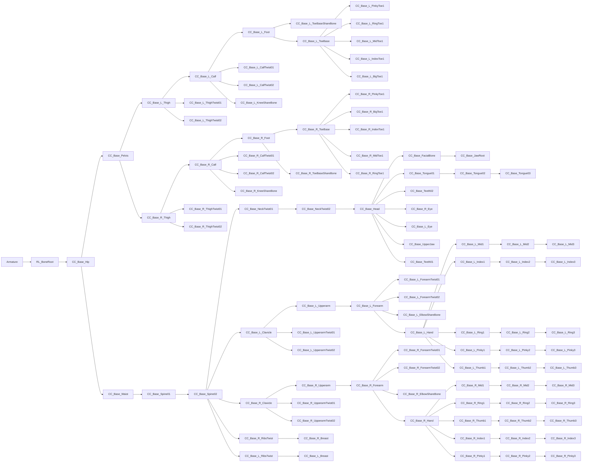

# UE5AccuRIG
UE5용 컨트롤릭 사용을 위한 캐릭터 제작

AccuRig Bledner용 본구조


```
Armature
└─ RL_BoneRoot
   └─ CC_Base_Hip
      ├─ CC_Base_Pelvis
      │  ├─ CC_Base_L_Thigh
      │  │  ├─ CC_Base_L_Calf
      │  │  │  ├─ CC_Base_L_Foot
      │  │  │  │  ├─ CC_Base_L_ToeBaseShareBone
      │  │  │  │  └─ CC_Base_L_ToeBase
      │  │  │  │     ├─ CC_Base_L_PinkyToe1
      │  │  │  │     ├─ CC_Base_L_RingToe1
      │  │  │  │     ├─ CC_Base_L_MidToe1
      │  │  │  │     ├─ CC_Base_L_IndexToe1
      │  │  │  │     └─ CC_Base_L_BigToe1
      │  │  │  ├─ CC_Base_L_CalfTwist01
      │  │  │  ├─ CC_Base_L_CalfTwist02
      │  │  │  └─ CC_Base_L_KneeShareBone
      │  │  ├─ CC_Base_L_ThighTwist01
      │  │  └─ CC_Base_L_ThighTwist02
      │  ├─ CC_Base_R_Thigh
      │  │  ├─ CC_Base_R_ThighTwist01
      │  │  └─ CC_Base_R_ThighTwist02
      │  └─ CC_Base_R_Calf
      │     ├─ CC_Base_R_Foot
      │     │  ├─ CC_Base_R_ToeBase
      │     │  │  ├─ CC_Base_R_PinkyToe1
      │     │  │  ├─ CC_Base_R_BigToe1
      │     │  │  ├─ CC_Base_R_IndexToe1
      │     │  │  ├─ CC_Base_R_MidToe1
      │     │  │  └─ CC_Base_R_RingToe1
      │     │  └─ CC_Base_R_ToeBaseShareBone
      │     ├─ CC_Base_R_KneeShareBone
      │     ├─ CC_Base_R_CalfTwist01
      │     └─ CC_Base_R_CalfTwist02
      └─ CC_Base_Waist
         └─ CC_Base_Spine01
            └─ CC_Base_Spine02
               ├─ CC_Base_NeckTwist01
               │  └─ CC_Base_NeckTwist02
               │     └─ CC_Base_Head
               │        ├─ CC_Base_FacialBone
               │        │  └─ CC_Base_JawRoot
               │        ├─ CC_Base_Tongue01
               │        │  └─ CC_Base_Tongue02
               │        │     └─ CC_Base_Tongue03
               │        ├─ CC_Base_Teeth02
               │        ├─ CC_Base_R_Eye
               │        ├─ CC_Base_L_Eye
               │        ├─ CC_Base_UpperJaw
               │        └─ CC_Base_Teeth01
               ├─ CC_Base_L_Clavicle
               │  ├─ CC_Base_L_Upperarm
               │  │  └─ CC_Base_L_Forearm
               │  │     ├─ CC_Base_L_ForearmTwist01
               │  │     ├─ CC_Base_L_ForearmTwist02
               │  │     ├─ CC_Base_L_ElbowShareBone
               │  │     └─ CC_Base_L_Hand
               │  │        ├─ CC_Base_L_Mid1 → L_Mid2 → L_Mid3
               │  │        ├─ CC_Base_L_Index1 → L_Index2 → L_Index3
               │  │        ├─ CC_Base_L_Ring1  → L_Ring2  → L_Ring3
               │  │        ├─ CC_Base_L_Pinky1 → L_Pinky2 → L_Pinky3
               │  │        └─ CC_Base_L_Thumb1 → L_Thumb2 → L_Thumb3
               │  ├─ CC_Base_L_UpperarmTwist01
               │  └─ CC_Base_L_UpperarmTwist02
               ├─ CC_Base_R_Clavicle
               │  └─ CC_Base_R_Upperarm
               │     ├─ CC_Base_R_UpperarmTwist01
               │     ├─ CC_Base_R_UpperarmTwist02
               │     └─ CC_Base_R_Forearm
               │        ├─ CC_Base_R_ForearmTwist01
               │        ├─ CC_Base_R_ForearmTwist02
               │        ├─ CC_Base_R_ElbowShareBone
               │        └─ CC_Base_R_Hand
               │           ├─ CC_Base_R_Mid1   → R_Mid2   → R_Mid3
               │           ├─ CC_Base_R_Ring1  → R_Ring2  → R_Ring3
               │           ├─ CC_Base_R_Thumb1 → R_Thumb2 → R_Thumb3
               │           ├─ CC_Base_R_Index1 → R_Index2 → R_Index3
               │           └─ CC_Base_R_Pinky1 → R_Pinky2 → R_Pinky3
               ├─ CC_Base_R_RibsTwist
               │  └─ CC_Base_R_Breast
               └─ CC_Base_L_RibsTwist
                  └─ CC_Base_L_Breast
```
